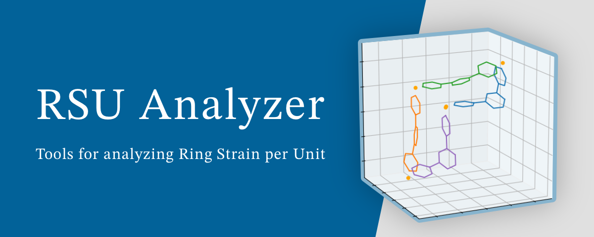

# RSU Analyzer

RSU Analyzer is a Python project developed by Hiraoka Laboratory at The University of Tokyo for the scientific paper titled: **Rational design of metal-organic cages to increase the number of components via dihedral angle control** by T. Abe, K. Takeuchi, and <INS>S. Hiraoka</INS>. (DOI: [10.26434/chemrxiv-2024-m8m60](https://doi.org/10.26434/chemrxiv-2024-m8m60))

This project focuses on analyzing Ring Strain per Unit (RSU), which acts as an indicator for estimating purely geometric strains in M<sub>*n*</sub>L<sub>*n*</sub> subcomponent rings in M<sub>6</sub>L<sub>4</sub>, M<sub>9</sub>L<sub>6</sub>, and M<sub>12</sub>L<sub>8</sub> assemblies, where L is 1,3,5-tris(4-pyridyl)benzene and M indicates the metal ion that connects two L with an L–M–L angle of 90°. In the analysis, 1,3-di(4-pyridyl)benzene was used as L instead of 1,3,5-tris(4-pyridyl)benzene, and the ring strain was evaluated for M<sub>*n*</sub>L<sub>*n*</sub> rings (*n* = 2–4) with variable L–M–L angles. For more detailed information, please refer to the associated research paper. (DOI: [10.26434/chemrxiv-2024-m8m60](https://doi.org/10.26434/chemrxiv-2024-m8m60))

## Key components:
- Scripts for reproducing and analyzing the results presented in the paper, along with the generated results (located in the `analysis` directory). These scripts utilize functionalities provided by the `rsuanalyzer` and `chainvisualizer` packages below.
- The `rsuanalyzer` package, which contains tools for RSU analysis.
- The `chainvisualizer` package, which provides utilities for visualizing chains using matplotlib 3D plots.


## Installation
To install the project, follow these steps:

1. Clone this repository:
```bash
git clone https://github.com/Hiraoka-Group/rsuanalyzer.git
```

2. Navigate to the project directory:
```bash
cd rsuanalyzer
```

3. Install the required packages:
```bash
poetry install
```


## Usage-1: Reproducing the results in the paper
To reproduce the results presented in the paper, run the scripts located in the `analysis` directory.

To execute each module within the `analysis` directory, use commands like following:
```bash
python3 -m analysis.chain_visualization.src.syns1_theta38
```

This example command runs the `syns1_theta38.py` script located in the `analysis/chain_visualization/src` directory.

> [!IMPORTANT]
> Ensuring that you execute each module from the project's root directory is essential. Attempting to run modules directly from their respective directories (like the `analysis/chain_visualization/src` directory in this scenario) could lead to import errors.

## Usage-2: Using RSU Analyzer and Chain Visualizer packages
Please see the document:
[Documentation of RSU Analyzer](https://hiraoka-group.github.io/rsuanalyzer-doc/)

## License
This project is licensed under the MIT License. See the LICENSE file for details.
