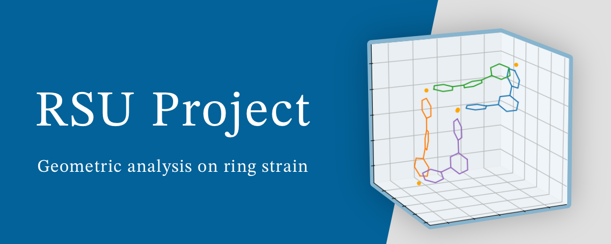

# RSU Analyzer

RSU Analyzer is a Python project developed by Hiraoka Laboratory at The University of Tokyo for the scientific paper titled: **Rational design of metal-organic cages to increase the number of components via dihedral angle control** by T. Abe, K. Takeuchi, <INS>S. Hiraoka</INS>.

This project focuses on analyzing RSU (Ring Strain per Unit), which acts as an indicator for estimating purely geometric strains in rings comprised of the ditopic ligand 1,3-di(4-pyridyl)benzene. These rings serve as models for subcomponent rings in Pd6L4, Pd9L6, and Pd12L8 assemblies, where L represents tritopic ligands.

Key components of this project include:
- Scripts for reproducing and analyzing the results presented in the paper, along with the generated results (located in the `analysis` directory). These scripts utilize functionalities provided by the `rsuanalyzer` and `chainvisualizer` packages below.
- The `rsuanalyzer` package, which contains tools for RSU analysis.
- The `chainvisualizer` package, which provides utilities for visualizing chains using matplotlib 3D plots.


## Installation
To install the project, follow these steps:

1. Clone this repository:
```bash
git clone https://github.com/neji-craftsman/rsuanalyzer.git
```

2. Navigate to the project directory:
```bash
cd rsuanalyzer
```

3. Install the required packages:
```bash
pip install -r requirements.txt
```


## Main Usage: Reproducing Results from the Paper
Scripts for reproducing the results from the paper are located in the analysis directory.

To execute each module within the analysis directory, use the following command:
```bash
python3 -m analysis.chain_visualization.src.syns1_theta38
```
It's crucial to execute each module from the project's root directory. Running modules directly from their respective directories (such as the `src` directory in this case) may result in import errors.


## License
This project is licensed under the CC BY-NC 4.0 License, following the same terms as the associated paper. See the LICENSE file for details.
