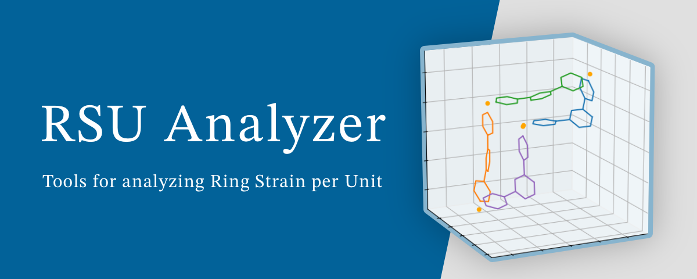

.. RSU Analyzer documentation master file, created by
   sphinx-quickstart on Mon Feb 12 21:28:45 2024.
   You can adapt this file completely to your liking, but it should at least
   contain the root `toctree` directive.

 
Welcome to RSU Analyzer's documentation!
========================================

About
----------------------------------------
RSU Analyzer is a Python project developed by Hiraoka Laboratory at The University of Tokyo for the scientific paper titled: **Rational design of metal-organic cages to increase the number of components via dihedral angle control** by T. Abe, K. Takeuchi, and S. Hiraoka. (DOI: `10.26434/chemrxiv-2024-m8m60 <https://doi.org/10.26434/chemrxiv-2024-m8m60>`_)

This project focuses on analyzing ring strain per unit (RSU), which acts as an indicator for estimating purely geometric strains in M\ :sub:`n`\ L\ :sub:`n`\  subcomponent rings in M\ :sub:`6`\ L\ :sub:`4`\ , M\ :sub:`9`\ L\ :sub:`6`\ , and M\ :sub:`12`\ L\ :sub:`8`\  assemblies, where L is 1,3,5-tris(4-pyridyl)benzene and M indicates the metal ion that connects two L with an L–M–L angle of 90°. In the analysis, 1,3-di(4-pyridyl)benzene was used as L instead of 1,3,5-tris(4-pyridyl)benzene, and the ring strain was evaluated for M\ :sub:`n`\ L\ :sub:`n`\  rings (*n* = 2–4) with variable L–M–L angles. 

For more detailed information, please refer to the associated research paper. (DOI: `10.26434/chemrxiv-2024-m8m60 <https://doi.org/10.26434/chemrxiv-2024-m8m60>`_)

Key Components
----------------------------------------
- Scripts for reproducing and analyzing the results presented in the paper, along with the generated results (located in the `analysis` directory). These scripts utilize functionalities provided by the :doc:`RSU Analyzer <rsuanalyzer>` and :doc:`Chain Visualizer <chainvisualizer>` below.
- The :doc:`RSU Analyzer <rsuanalyzer>`, which contains tools for RSU analysis.
- The :doc:`Chain Visualizer <chainvisualizer>`, which provides utilities for visualizing chains using matplotlib 3D plots.

Contents
----------------------------------------
.. toctree::
   :maxdepth: 1
   :titlesonly:

   RSU Analyzer <rsuanalyzer>
   Chain Visualizer <chainvisualizer>

Indices and tables
----------------------------------------

* :ref:`genindex`
* :ref:`modindex`
* :ref:`search`
